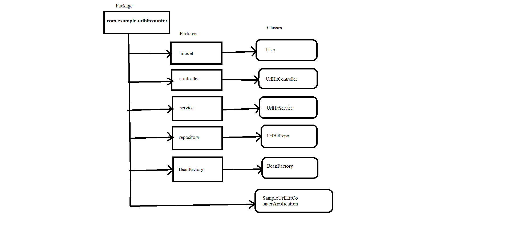

## **Frameworks and language used**
* SpringBoot Framework and java language.
## **Data Flow**

## **Data Structure used in your project**
* Arraylist
## **Project Summary**

This is my "Url-Hit-Counter" Application which follows MVC-architecture.I have created a package of springBoot-User-Management-System Application and inside this package I have created five more package i.e, controller,Beanfactory,model,repository,services.Each package consist of its own java class. Here package model have user class which specify userName. In Service package I have urlHitService class which have primitive data int as a hitCount.Next important class is user controller which helps us to perform CRUD operations i.e., @GetMapping and @PostMapping.

